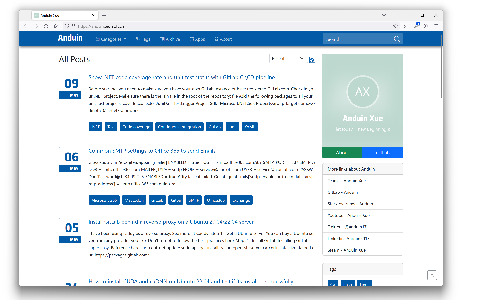
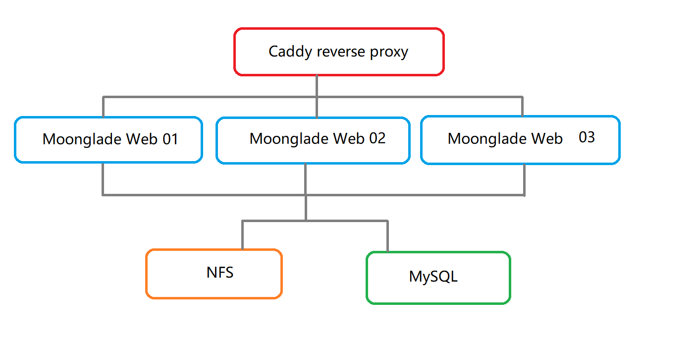

# MoongladePure

[](https://gitlab.aiursoft.cn/aiursoft/moongladepure/-/blob/master/LICENSE)
[](https://gitlab.aiursoft.cn/aiursoft/moongladepure/-/pipelines)
[](https://gitlab.aiursoft.cn/aiursoft/moongladepure/-/pipelines)
[](https://www.nuget.org/packages/MoongladePure.Core/)
[](https://anduin.aiursoft.com)

MoongladePure, regain control over your data.

MoongladePure can be deployed completely on-premises without coupling to any particular cloud. 100% local!

MoongladePure uses MySQL as database and file system as data store. It's extremely easy to try and deploy!

<div align=center>
    
</div>

## Run locally

Install [.NET 6 SDK](http://dot.net/).

Clone the project and go to the web project to run it. **Only for development, NOT for production!**

```bash
git clone https://gitlab.aiursoft.cn/aiursoft/moongladepure.git
cd ./MoongladePure/src/Moonglade.Web/
ASPNETCORE_ENVIRONMENT=Development dotnet run --urls=http://0.0.0.0:8080
```

You may see the following output:

```log
warn: MoongladePure.Web[0]
      Running in environment: Development.
info: Microsoft.Hosting.Lifetime[14]
      Now listening on: http://0.0.0.0:8080
info: Microsoft.Hosting.Lifetime[0]
      Application started. Press Ctrl+C to shut down.
```

Now open your browser and browse to [http://localhost:8080](http://localhost:8080). You should see the MoongladePure welcome page.

## Run in Docker

Install Docker and Docker-Compose [here](https://docs.docker.com/compose/install/).

Then run the following commands in the project path:

```bash
docker-compose build
docker-compose up
```

That will start a web server at `http://localhost:8080` and you can test the app.

## Run in a production server

It is suggested to use Ubuntu 22.04 LTS as the operating system.

### Prerequisites

* MySQL
* .NET
* Caddy(Optional)

### Prepare MySQL Server

Install MySQL server as the database of MoongladePure.

The database can be a different server from the Web app server.

```bash
sudo apt install mysql-server -y
sudo systemctl enable mysql
sudo systemctl start mysql
```

Set admin password:

```bash
sudo mysql_secure_installation
```

Or

```bash
sudo mysql
ALTER USER 'root'@'localhost' IDENTIFIED WITH mysql_native_password by 'mynewpassword';
exit;
```

To sign in your MySQL:

```bash
sudo mysql -u root -p
```

Create a database for MoongladePure:

```sql
CREATE DATABASE MoongladePure;
CREATE USER 'moongladepure'@'localhost' IDENTIFIED BY 'YOUR_STRONG_PASSWORD';
GRANT ALL PRIVILEGES ON MoongladePure.* TO 'moongladepure'@'localhost';
FLUSH PRIVILEGES;
exit;
```

### Prepare a storage path

Create a folder for MoongladePure to store data:

```bash
sudo mkdir /mnt/datastore
sudo chown -R www-data:www-data /mnt/datastore
```

### Download MoongladePure

You can download MoongladePure via:

```bash
wget https://gitlab.aiursoft.cn/aiursoft/moongladepure/-/archive/master/moongladepure-master.tar.gz
tar -zxvf ./moongladepure-master.tar.gz moongladepure-master/
ls
```

### Build MoongladePure

Install dotnet6 first.

```bash
sudo apt install -y dotnet6
```

Prepare a directory:

```bash
sudo mkdir -p /opt/apps/MoongladePure
sudo chown -R www-data:www-data /opt/apps/MoongladePure
```

Then build it:

```bash
dotnet publish -c Release -o ./bin -r linux-x64 --no-self-contained ./moongladepure-master/src/Moonglade.Web/MoongladePure.Web.csproj
```

Copy the files to the directory:

```bash
sudo cp ./bin/* /opt/apps/MoongladePure/ -rv
sudo chown -R www-data:www-data /opt/apps/MoongladePure
```

Download related fonts:

```bash
sudo mkdir /usr/share/fonts
sudo wget https://gitlab.aiursoft.cn/aiursoft/moongladepure/-/raw/master/assets/OpenSans-Regular.ttf -O /usr/share/fonts/OpenSans-Regular.ttf
sudo chown www-data:www-data /usr/share/fonts/OpenSans-Regular.ttf
```

### Edit the configuration

Copy the configuration file as production first:

```bash
sudo -u www-data cp /opt/apps/MoongladePure/appsettings.json /opt/apps/MoongladePure/appsettings.Production.json
```

Then edit the production JSON file.

* Make the database connection string to your real database.
* Make the storage path to be your real storage path.

```bash
sudo -u www-data vim /opt/apps/MoongladePure/appsettings.Production.json
```

### Run MoongladePure

First register MoongladePure as a service:

```bash
echo '[Unit]
Description=MoongladePure Service
After=network.target mysql.service
Wants=network.target mysql.service

[Service]
Type=simple
User=www-data
ExecStart=/usr/bin/dotnet /opt/apps/MoongladePure/MoongladePure.Web.dll --urls=http://0.0.0.0:48466/
WorkingDirectory=/opt/apps/MoongladePure
Restart=always
RestartSec=10
KillSignal=SIGINT
Environment="ASPNETCORE_ENVIRONMENT=Production"
Environment="DOTNET_PRINT_TELEMETRY_MESSAGE=false"
Environment="DOTNET_CLI_TELEMETRY_OPTOUT=1"
Environment="ASPNETCORE_FORWARDEDHEADERS_ENABLED=true"

[Install]
WantedBy=multi-user.target' | sudo tee -a /etc/systemd/system/moongladepure.service
```

Then start the service.

```bash
sudo systemctl daemon-reload
sudo systemctl enable moongladepure
sudo systemctl start moongladepure
```

Now you can visit your MoongladePure site via `http://your-ip:48466`.

The admin panel is at `http://your-ip:48466/admin`. The default username is `admin` and password is `admin123`.

### Prepare HTTPS

Please make sure you have a domain name ready and point to your server's IP address.

Then install a reverse proxy server. For example, I'm using Caddy.

```bash
echo "deb [trusted=yes] https://apt.fury.io/caddy/ /" | sudo tee -a /etc/apt/sources.list.d/caddy-fury.list
sudo apt update
sudo apt install caddy -y
```

Then edit the Caddyfile:

```bash
sudo vim /etc/caddy/Caddyfile
```

Add the following content:

```bash
your.domain.com {
        reverse_proxy http://localhost:48466 {
        }
}
```

Then restart Caddy:

```bash
sudo systemctl restart caddy
```

Now try to open your browser and try:

```bash
https://your.domain.com
```

### Advanced setup

MoongladePure supports scaling out. You can deploy multiple MoongladePure instances to serve your users.



The following articles might be needed.

You can follow the best practice after having a Linux server.

- [Best practice after having a Linux server](https://anduin.aiursoft.cn/post/2020/7/26/bestpractice-for-authentication-after-creating-a-new-linux-server)

If you deployed the MySQL database on another server, you might need to set up MySQL to allow remote connection.

- [How to set up MySQL remote connection](https://anduin.aiursoft.cn/post/2022/10/19/mysql-allow-remote-connection-for-root-and-other-users)

If you want to share the storage path on a different remote server to scale out, you can use NFS to share the folder.

- [How to set up NFS to mount a path to other servers](https://anduin.aiursoft.cn/post/2022/9/18/build-a-new-nfs-server-with-winserver-or-ubuntu-and-mount-it)

Yes! MoongladePure is stateless. You can setup multiple MoongladePure Web servers to scale out and shares the same database and NFS storage.

And in that case, you need Caddy as a load balance. Here are some tips:

- [Caddy load balance and health monitoring](https://anduin.aiursoft.cn/post/2022/9/23/caddyv2-tips)

It is also suggested to mount a big disk to save your blog's content. View more here:

- [Mounting a big disk in Linux](https://anduin.aiursoft.cn/post/2022/7/5/install-nextcloud-on-a-ubuntu-2004-server#bigger-hdd)

## How to contribute

There are many ways to contribute to the project: logging bugs, submitting pull requests, reporting issues, and creating suggestions.

Even if you with push rights on the repository, you should create a personal fork and create feature branches there when you need them. This keeps the main repository clean and your workflow cruft out of sight.

We're also interested in your feedback on the future of this project. You can submit a suggestion or feature request through the issue tracker. To make this process more effective, we're asking that these include more information to help define them more clearly.
